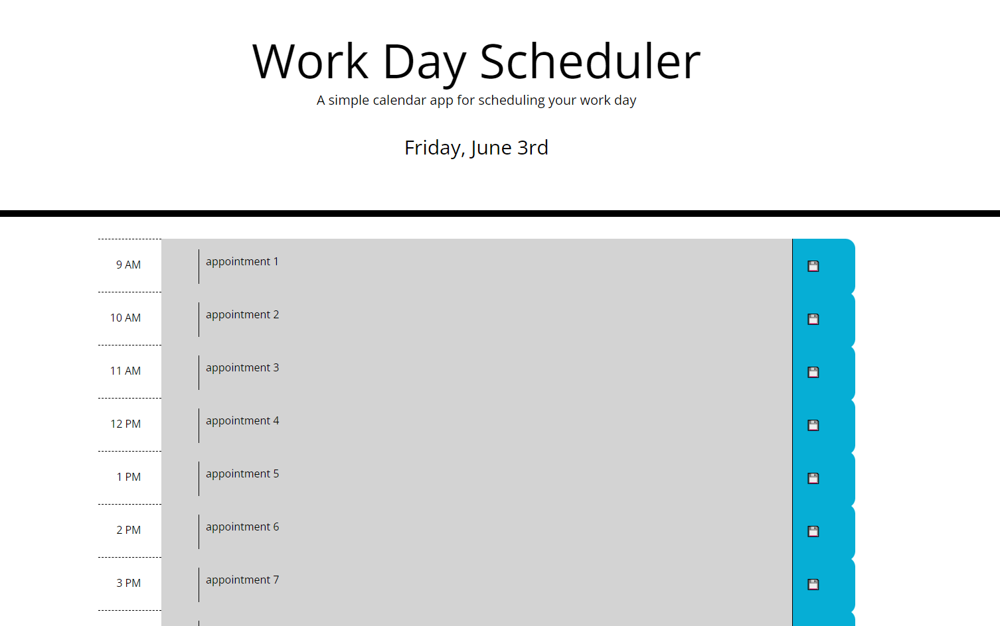

# GAB-Calender-C5

In this challenge I made a scheduler using html, css, and js. I used jquery to traverse the DOM and add class elements and text to the html. The save button uses a floppy disc icon and when clicked it adds the text to local storage so that it will remain even if the page is refreshed. 

<a href=https://gabeab34.github.io/GAB-Calender-C5/ alt="my webpage"> My Webpage